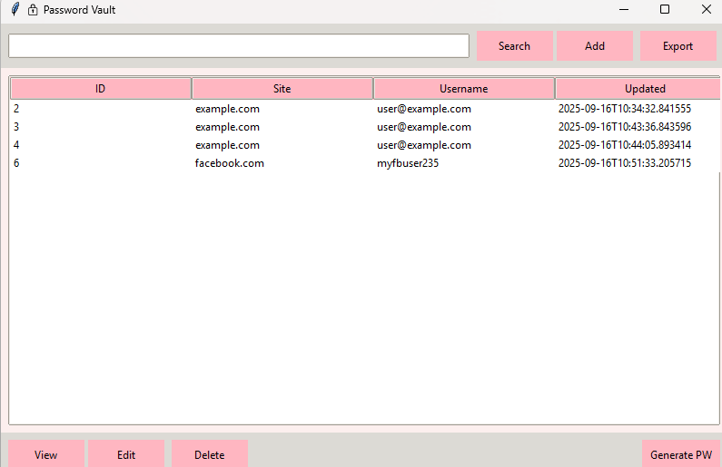
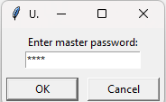
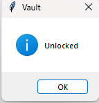
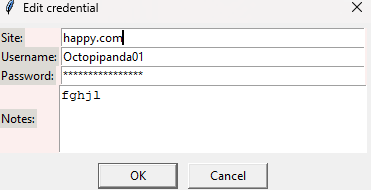
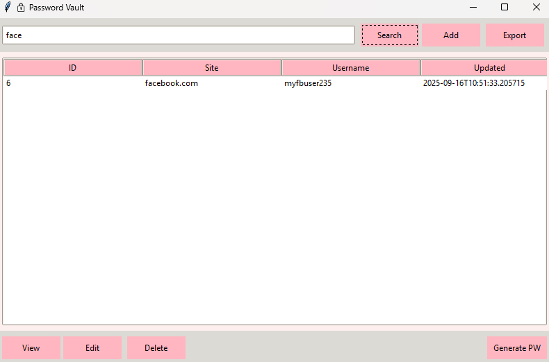
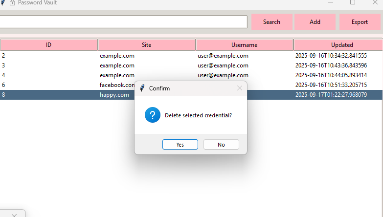
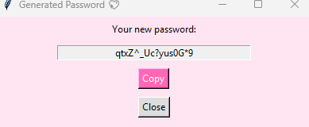
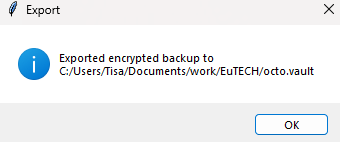

# 🔐 Password Vault  

A secure password manager built in **Python (Tkinter + SQLite)** with **AES encryption**.  
It allows you to safely store, search, edit, and manage credentials using a master password.  

---

## ✨ Features  

- 🔑 **Master Password** – Unlocks the vault securely.  
- 🗄 **Encrypted Database** – Passwords are encrypted before being stored in SQLite.  
- ➕ **Add / Edit / Delete Credentials** – Manage your saved logins easily.  
- 🔍 **Search Function** – Quickly find saved accounts.  
- 👁 **View Decrypted Passwords** – Securely view your saved credentials.  
- 🎲 **Password Generator** – Generate random, strong passwords.  
- 📤 **Export Backup** – Save an encrypted `.vault` backup of your credentials.  
- 🛡 **Error Handling & Validation** – Secure and user-friendly experience.  

---

## 📸 Screenshots  

**Main Screen**  
  

**Unlock Vault**  
  
  

**Add / Edit Credentials**  
  
  

**Search**  
  

**Delete Confirmation**  
  

**Password Generator**  
  

**Export Confirmation**  
  

---

## ⚙️ Installation  

1. Clone this repository:

   git clone https://github.com/yourusername/password-vault.git
   cd password-vault

2. (Optional but recommended) Create a virtual environment:

python -m venv venv
source venv/bin/activate   # On Linux/Mac
venv\Scripts\activate      # On Windows

3. Install dependencies:

pip install -r requirements.txt

4. Run the app:

python main.py

📂 Project Structure
password-vault/
│── main.py              # Entry point (launch GUI)
│── gui.py               # Tkinter GUI
│── db.py                # SQLite database operations
│── crypto.py            # Encryption & decryption
│── generator.py         # Password generator
│── requirements.txt     # Dependencies
│── screenshots/         # App screenshots

🧪 Usage

1. First Run:

You will be prompted to create a Master Password.

Remember this password – without it, you cannot unlock the vault.

2. Adding Credentials:

Click Add, enter your site, username, password, and notes.

Passwords are encrypted before saving.

3. Viewing Credentials:

Double-click an entry or click View to see the decrypted password.

4. Export Backup:

Use Export to save an encrypted backup file.

📌 Requirements

Python 3.10+

Packages:

cryptography
tk
sqlite3

🛡 Security Notes

Your vault is encrypted using AES-256 (via Fernet).

Master password is never stored directly. Instead, a PBKDF2-based verifier with salt + iterations is used.

Exported backups are also encrypted – only accessible with the master password.

👨‍💻 Author

Developed by Tisankhe Sito Mwanza ✨
